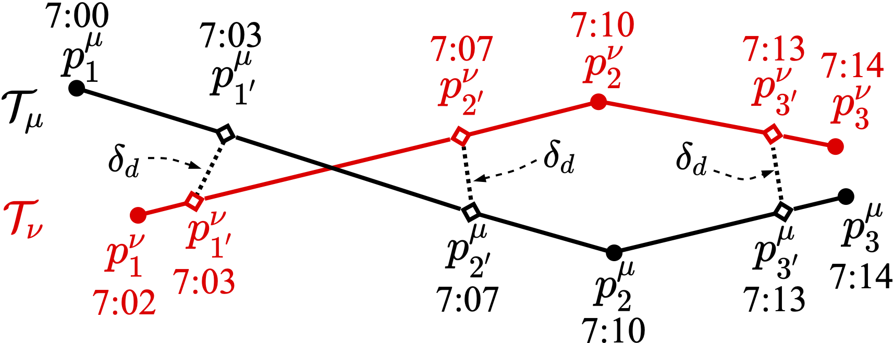

## Sub-trajectory Similarity Join with Obfuscation


<p align="center">
  
</p>

C++ implementation for Close-distance Duration Similarity (CDDS) of trajectories in paper [Sub-trajectory Similarity Join with Obfuscation](https://people.eng.unimelb.edu.au/jianzhongq/papers/SSDBM2021_Sub-trajectorySimilarityJoin.pdf):


```
@inproceedings{chang2021sub,
  title={Sub-trajectory similarity join with obfuscation},
  author={Chang, Yanchuan and Qi, Jianzhong and Tanin, Egemen and Ma, Xingjun and Samet, Hanan},
  booktitle={33rd International Conference on Scientific and Statistical Database Management},
  pages={181--192},
  year={2021}
}
```

P.S. The purpose of this repository is to provide an implementation of CDDS spatio-temporal trajectory similarity (cf. Definition 3.1 in the aforementioned paper). Thus, we removed the redundant parts from the orginal implementation, such as STS-Index and STS-Join.

#### Requirements

- Linux with g++ (supporting c++11, e.g., g++ 8.4.0)

#### Quick Start

```bash
make clean && make
./test_cdds
```